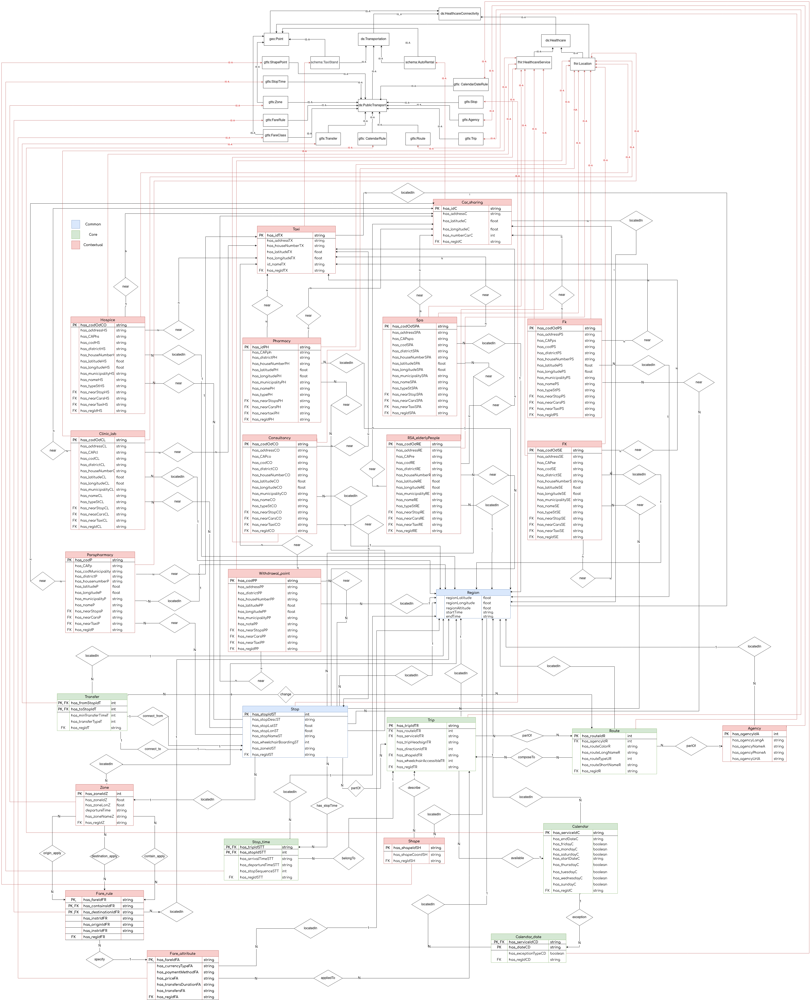
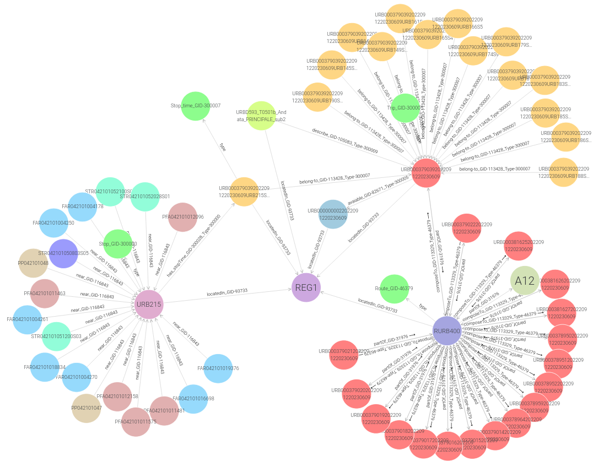

# Trentino Transportation

By Manuela Corte Pause and Guglielmo Zocca

## Links to the material

### GitHub
<https://github.com/ManuelaCorte/KGE_Trentino_Healthcare_Connectivity>

### Google Drive
<https://drive.google.com/drive/folders/1URm3GYskjv0gTmxl_dMn_fB4hyTEWr4f?usp=share_link>

### Report
<https://docs.google.com/presentation/d/1aBu4kIEsTBMBYuyMmyZuJ49gKM4YA0YH/edit?usp=share_link&ouid=113661818716318435556&rtpof=true&sd=true>

### Presentation
<https://docs.google.com/presentation/d/1aBu4kIEsTBMBYuyMmyZuJ49gKM4YA0YH/edit?usp=share_link&ouid=113661818716318435556&rtpof=true&sd=true>

## Domain
Our domain of interest is compromised of the intersection of two major domain: the healthcare one and the transportation one since we’re interested on how to reach healthcare facilities through public transportation.

Our domain is bounded in space and time by the following values :
* Space: Autonomous province of Trentino
* Time: in order for our project to be somewhat usable in the real world we want to use the current data about public transportation so we’ll refer to the year 2022-2023. In particular the time period is bounded between 11/06/2022 and 09/06/2023

## Purpose
The purpose of this project is to help patients and healthcare workers commute from and to different healthcare facilities in Trentino. We focus on public transport, such as busses and trains, as well as less conventional ways of travelling such as car sharing and taxis in order for our final users to save both time and money.

## Data Resources
The 7 initial datasets we used in total and the brief descriptions are delineated below:

1. Trentino Trasporti 
   <https://www.trentinotrasporti.it/open-data> 
   Data about public urban and extra-urban transportation in GTFS format. Contains mainly information about bus stops, lines list, rides, leaving and arriving times. We’ll use this data source for both urban and extra urban transportation.
2. Open Data in Trentino 
    <https://dati.trentino.it/> 
    Completing a federated process of opening up the public information asset by attending to the organisational change in order to stimulate growth, efficiency and participation; making of Trentino a high-data-culture-territory in an harmonised way from an institutional, legislative, organisational and technological standpoint, by aligning to the EU and national directives for the development of the Digital Agenda in view of the Digital Single Market. This data source will be used for all information about different healthcare facilities (hospitals, pharmacies, …) as well as the ones about taxis and car sharing.
   
## Knowledge Resources
1. Schema.org 
   <https://schema.org> 
   Schema.org is a collaborative, community activity with a mission to create, maintain, and promote schemas for structured data on the Internet. This Knowledge source will be used to model the etype for the taxi and car sharing service.
2. FHIR 
   <https://hl7.org/fhir/> 
   FHIR is a standard for healthcare data exchange. This Knowledge source will be used to model the etype concerned about healthcare facilities.
3. GTFS 
    <https://developers.google.com/transit/gtfs> 
    GTFS, which stands for General Transit Feed Specification or (originally) Google Transit Feed Specification, defines a common format for public transportation schedules and associated geographic information. In particular we’ll use the GTFS static standard to model public transportation.
4. W3C 
    <https://www.w3.org/> 
    The World Wide Web Consortium (W3C) is an international community where Member organizations, a full-time staff, and the public work together to develop Web standards. In particular from W3C we’ll use a vocabulary to describe geographical coordinate.

## Teleontology
 <https://drive.google.com/file/d/19f85ibLduqMzDH8xPaH5HkT3vDdXeJNh/view?usp=share_link>

## Final Graph RDF
<https://github.com/ManuelaCorte/KGE_Trentino_Healthcare_Connectivity/tree/main/Datasets/Data%20Integration>

Below a snaphsot of part of the final graph.

